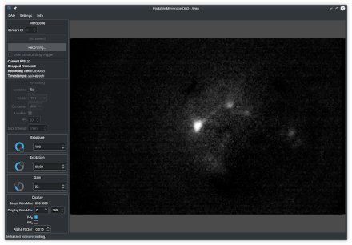

PoMiDAQ
=========

[](https://github.com/bothlab/pomidaq/tree/master/contrib/screenshots)

PoMiDAQ is a recording software for [UCLA Miniscopes](http://miniscope.org/index.php/Main_Page).
Unlike the [preexisting](https://github.com/daharoni/Miniscope_DAQ_Software) Miniscope software, this program
is written to be portable, so it will run on Windows, Linux and (likely) macOS.
It is designed to work with the latest OpenCV libraries and provides a shared library, so Miniscope recording
features can easily be embedded into other programs and pipelines.
Recorded data is encoded with the [FFV1](https://en.wikipedia.org/wiki/FFV1) codec by default, to allow for
smaller video files at lossless quality that are safe to archive.

It also provides an experimental Python module to access a Miniscope easily from Python. This feature has
currently only been tested on Linux (and may stay Linux-only) and is still considered a bit experimental.

Some features the original Miniscope DAQ software has, like the behavior recording, are intentionally left out.
This software is developed on Linux, but has also been successfully tested on Windows. As of now, no macOS build
has been attempted.

## Users

The CI system provides up-to-date builds for PoMiDAQ for the **Windows** (64-bit) and **Debian** 9+ (amd64) platforms.
You can fetch builds from there or download prebuilt binaries from the [Github releases](https://github.com/bothlab/pomidaq/releases).
Don't hesitate to file issues if you notice anything unusual - since this software is very new, there is
still a good chance to encounter strange behavior that was not previously tested for.

## Developers


### Dependencies

 * CMake (>= 3.16)
 * Qt5 (>= 5.12)
 * FFmpeg (>= 4.1)
 * OpenCV (>= 4.1)
 * KF5ConfigWidgets (on Linux)
 * [pyBind11](https://github.com/pybind/pybind11) (optional)

Before attempting to build PoMiDAQ, ensure all dependencies (and their development files) are installed on your system.
You should then be able to build the software after configuring the build with cmake for your platform.

#### Debian-based Linux
On Debian-based Linux systems, all dependencies can be installed from the package repositories with this command:
```bash
sudo apt install cmake ninja-build qtbase5-dev libqt5opengl5-dev libkf5configwidgets-dev \
                 libopencv-dev libavcodec-dev libavformat-dev libswscale-dev \
                 pybind11-dev python3-dev python3-numpy build-essential
```
The software can then be built:
```bash
mkdir build && cd build
cmake -GNinja -DCMAKE_BUILD_TYPE=RelWithDebInfo ..
ninja
sudo ninja install
sudo ldconfig
```

#### MacOS
On macOS, dependencies can be obtained via the Homebrew package manager using the command:
```bash
brew install cmake ninja qt@5 ffmpeg python3 opencv numpy cython pybind11
```
The software can then be built:
```bash
mkdir build && cd build
cmake -GXcode -DCMAKE_BUILD_TYPE=RelWithDebInfo -DQt5_DIR=$(brew --prefix qt5)/lib/cmake/Qt5 -DCMAKE_OSX_ARCHITECTURES="x86_64;arm64" ..
```
You can then open the XCode project and build the "All Targets" target. 


Pull-requests are very welcome! (Code should be valid C++14, use 4 spaces for indentation)
